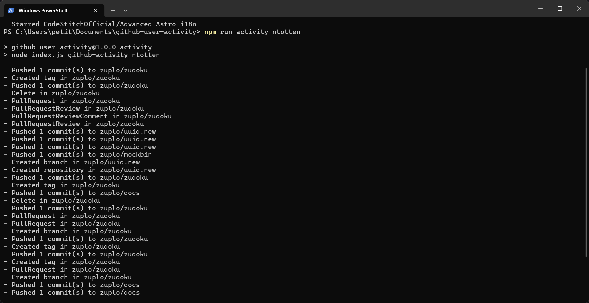

## Description

In this project, you will build a simple command line interface (CLI) to fetch the recent activity of a GitHub user and display it in the terminal. This project will help you practice your programming skills, including working with APIs, handling JSON data, and building a simple CLI application.

## Table of Contents

- [Project link](#project-link)
- [Requirements](#requirements)
- [Commands](#commands)
- [Usage](#usage)
- [Screenshots](#screenshots)
- [Contact](#contact)


## Project link

[https://roadmap.sh/projects/github-user-activity](https://roadmap.sh/projects/github-user-activity)

## Requirements

The application should run from the command line, accept the GitHub username as an argument, fetch the user’s recent activity using the GitHub API, and display it in the terminal. The user should be able to:

- Provide the GitHub username as an argument when running the CLI.

```bash
github-activity <username>
```

- Fetch the recent activity of the specified GitHub user using the GitHub API. You can use the following endpoint to fetch the user’s activity:

```bash
# https://api.github.com/users/<username>/events
# Example: https://api.github.com/users/kamranahmedse/events
```

- Display the fetched activity in the terminal

```bash
Output:
- Pushed 3 commits to kamranahmedse/developer-roadmap
- Opened a new issue in kamranahmedse/developer-roadmap
- Starred kamranahmedse/developer-roadmap
- ...
```

## Commands

The commands are executed from the CLI with `npm run` or `yarn dev` with one of the following arguments that takes

- `github-activity`: View recent information of the github user being requested

## Usage

Here are the basic commands to use the CLI GitHub User Activity:

```bash
npm run activity <username>
```
## Screenshots



## Contact

If you have any questions or suggestions, feel free to contact us:

- Author name: [Erick Gonzalez](https://github.com/muke78)
- Email : <erickm.gonzalez.rivera@gmail.com>